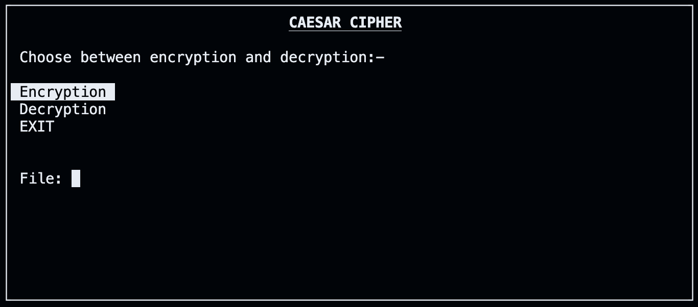
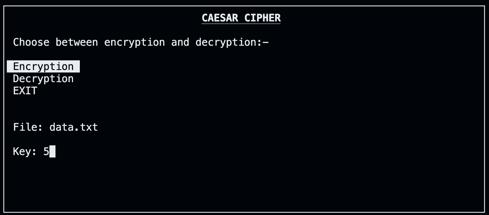
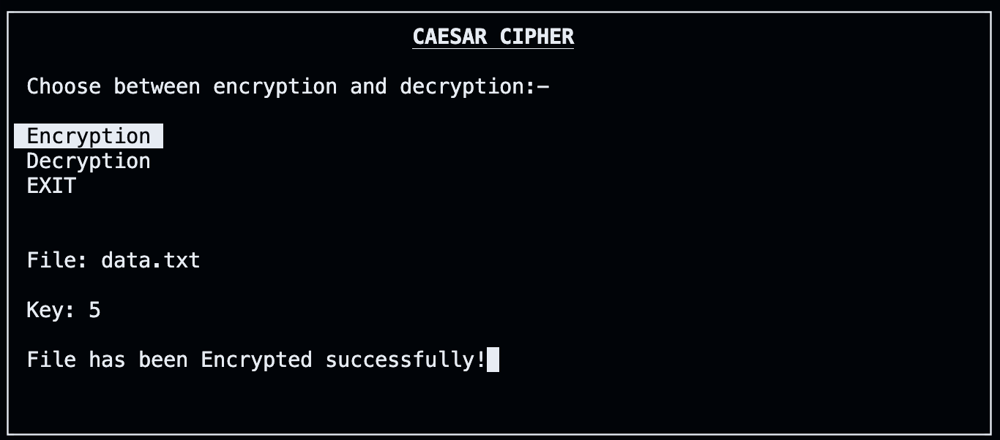
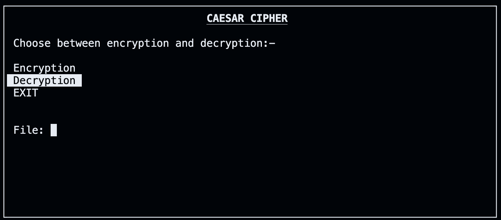
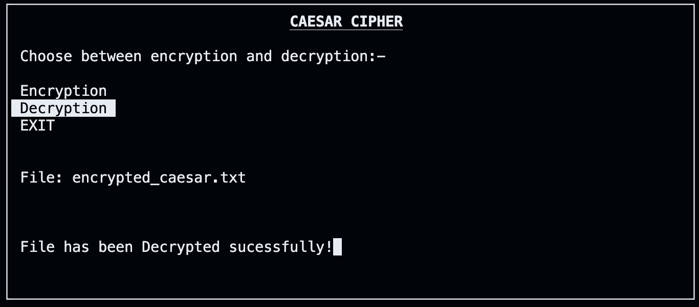
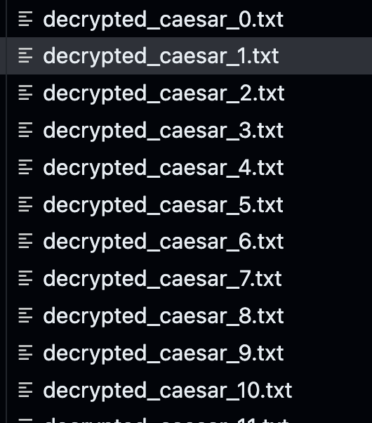

# SecureCipher
### Minor Project for the Introductory Course in Computer Science (CSL1010)

A File encrypter and Decrypter that works based on Caesar Cipher.

## Dependency : Ncurses - Setup and Running the Program
### MacOS installation

- Then we will install ncurses using brew
```
brew install ncurses
```

This will install NCurses and set it on the user path

To run the program we need to enter this in terminal (We need to link the ncurses library to our program)
```
gcc -lncurses <filename.c> <filename.out>
```

After running the file, a User Interface will open up in the terminal which look something like this:


You can use your arrow keys to select an option, if you want to either encrypt a file or decrypt a file or EXIT the program.

### Encryption


If you choose to encrypt a file, input the name of the file with the extension (.txt).

Input the key.



The file will be encrypted.




### Decryption



If you choose to decrypt a file, input the name of the file with the extension (.txt).


The file will be decrypted.



Decrypted files will look something like this.

